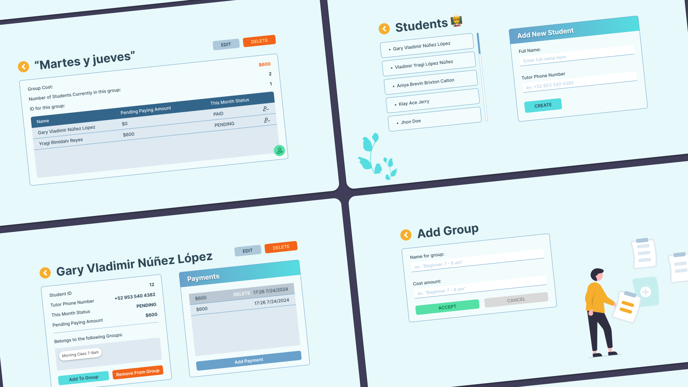

# Student Track App

The **Student Track App** is a comprehensive platform designed to help administrators manage students and groups, track payments, and maintain student records efficiently. This full-stack application provides an intuitive interface and robust functionalities for managing educational institutions' administrative tasks.

## Features

- **Student Management**: Add, edit, and delete student records.
- **Group Management**: Create groups, assign students to groups, and manage group details.
- **Payment Tracking**: Record payments made by students, view payment history, and track pending amounts.
- **Payment Status**: Automatic calculation of the student's payment status (PAID, PENDING, BEHIND).
- **Role-Based Access Control (RBAC)**: Different access levels for administrators and teachers.

## Screenshots



## Live Demo

- Frontend: [https://student-track-app-frontend.onrender.com](https://student-track-app-frontend.onrender.com)
- Backend API: [https://student-track-app-backend.onrender.com](https://student-track-app-backend.onrender.com)

## Technology Stack

- **Backend**: Python 3.9+, Flask, PostgreSQL, SQLAlchemy
- **Frontend**: React, Axios, Tailwind CSS
- **Authentication**: Auth0
- **Deployment**: Render

## Installation

### Prerequisites

- Python 3.9+
- Node.js and npm
- PostgreSQL

### Local Setup

1. **Clone the repository**:

   ```
   git clone https://github.com/gary-vladimir/Student_Track_App.git
   cd Student_Track_app
   ```

2. **Backend Setup**:

   - Navigate to the backend directory:
     ```
     cd backend
     ```
   - Create a virtual environment and install dependencies:
     ```
     python -m venv venv
     source venv/bin/activate  # On Windows use `venv\Scripts\activate`
     pip install -r requirements.txt
     ```
   - Create a `.env` file in the backend directory with the following contents:
     ```
     TEACHER_JWT_TOKEN=<your_teacher_jwt_token>
     ADMIN_JWT_TOKEN=<your_admin_jwt_token>
     CLIENT_ORIGIN_URL=http://localhost:3000
     ALGORITHMS=["RS256"]
     API_AUDIENCE=<your_api_audience>
     AUTH0_DOMAIN=<your_auth0_domain>
     ```
   - Set up the database:
     ```
     flask db upgrade
     ```
   - Run the backend server:
     ```
     python app.py
     ```

3. **Frontend Setup**:
   - Navigate to the frontend directory:
     ```
     cd ../frontend
     ```
   - Install dependencies:
     ```
     npm install
     ```
   - Create a `.env` file in the frontend directory with the following contents:
     ```
     REACT_APP_API_URL=http://localhost:5000
     REACT_APP_AUTH0_AUDIENCE=<your_auth0_audience>
     REACT_APP_AUTH0_CLIENT_ID=<your_auth0_client_id>
     REACT_APP_AUTH0_DOMAIN=<your_auth0_domain>
     ```
   - Start the frontend development server:
     ```
     npm start
     ```

## Usage

- Navigate to `http://localhost:3000` to use the application.
- Log in using your Auth0 credentials.
- The main dashboard provides options to manage students and groups.
- Click on a student or group to view and edit details.

## API Documentation

The backend API provides endpoints for managing students, groups, and payments. All endpoints require authentication using JWT tokens.

### Base URL

`https://student-track-app-backend.onrender.com`

### Authentication

All requests must include a valid JWT token in the Authorization header:

```
Authorization: Bearer <your_jwt_token>
```

### Endpoints

#### Groups

- `GET /api/groups`

  - Description: Fetch all groups
  - Permission: `get:groups`
  - Response: List of group objects

- `GET /api/groups/<group_id>`

  - Description: Fetch details of a specific group
  - Permission: `get:group`
  - Response: Group object

- `POST /api/groups`

  - Description: Create a new group
  - Permission: `create:group`
  - Request Body: `{ "title": "Group Name", "group_cost": 100 }`
  - Response: Created group object

- `PATCH /api/groups/<group_id>`

  - Description: Update group details
  - Permission: `patch:group`
  - Request Body: `{ "group_cost": 150 }`
  - Response: Updated group object

- `DELETE /api/groups/<group_id>`
  - Description: Delete a group
  - Permission: `delete:group`
  - Response: Deletion confirmation

#### Students

- `GET /api/students`

  - Description: Fetch all students
  - Permission: `get:students`
  - Response: List of student objects

- `GET /api/students/<student_id>`

  - Description: Fetch details of a specific student
  - Permission: `get:student`
  - Response: Student object

- `POST /api/students`

  - Description: Create a new student
  - Permission: `create:student`
  - Request Body: `{ "name": "Student Name", "parent_phone_number": "1234567890" }`
  - Response: Created student object

- `PATCH /api/students/<student_id>`

  - Description: Update student details
  - Permission: `patch:student`
  - Request Body: `{ "name": "Updated Name" }`
  - Response: Updated student object

- `DELETE /api/students/<student_id>`
  - Description: Delete a student
  - Permission: `delete:student`
  - Response: Deletion confirmation

#### Payments

- `POST /api/students/<student_id>/payments`

  - Description: Add a payment for a student
  - Permission: `create:payment`
  - Request Body: `{ "amount": 100 }`
  - Response: Created payment object

- `DELETE /api/students/<student_id>/payments/<payment_id>`

  - Description: Delete a specific payment
  - Permission: `delete:payment`
  - Response: Deletion confirmation

- `GET /api/students/<student_id>/payment_status`
  - Description: Get payment status for a student
  - Permission: `get:payment_status`
  - Response: Payment status object

### Role-Based Access Control (RBAC)

The application implements two roles with different permissions:

1. **Administrator**:

   - All permissions

2. **Teacher**:
   - `get:groups`
   - `get:group`
   - `get:students`
   - `get:student`
   - `get:payment_status`
   - `create:payment`

## Testing

To run the tests for the backend, navigate to the backend directory and run:

```
python test_app.py
```

This will execute the test suite, which includes tests for all API endpoints and RBAC controls.

## Deployment

The application is deployed on Render. For deployment instructions, refer to the [Render documentation](https://render.com/docs).

## Contributing

Contributions are welcome! Please feel free to submit a Pull Request.

## License

This project is licensed under the MIT License.

## Acknowledgements

- [React](https://reactjs.org/)
- [Flask](https://flask.palletsprojects.com/)
- [PostgreSQL](https://www.postgresql.org/)
- [Auth0](https://auth0.com/)
- [Render](https://render.com/)

## Contact

For any questions or suggestions, please contact us at [gary@garybricks.com].
